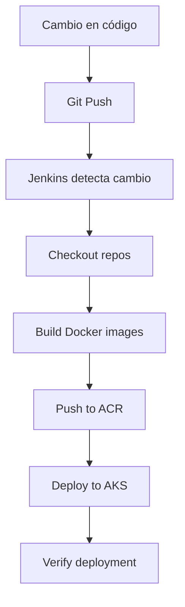

# Configuración Multi-Repositorio para Despliegue en AKS

Esta guía te ayudará a configurar el despliegue cuando tienes cada microservicio en un repositorio separado.

## 📁 Estructura de Repositorios

```
GitHub:
├── mmonedero1/aks_fastapi_01        # Microservicio Consultas
│   ├── Dockerfile
│   ├── main.py
│   └── pyproject.toml
│
├── mmonedero1/aks_fastapi_02        # Microservicio Valoraciones
│   ├── Dockerfile
│   ├── main.py
│   └── pyproject.toml
│
└── mmonedero1/fastapi-aks-k8s       # Manifiestos K8s + Pipeline (NUEVO)
    ├── k8s/
    │   ├── namespace.yaml
    │   ├── valoraciones-deployment.yaml
    │   ├── consultas-deployment.yaml
    │   └── ingress.yaml
    ├── Jenkinsfile.multi-repo
    └── README.md
```

## 🚀 Opción 1: Crear Repositorio de K8s (Recomendado)

### Paso 1: Crear el nuevo repositorio

```powershell
# Crear directorio para el nuevo repo
cd "c:\Users\s236244\OneDrive - ATOS\Documents\00_Entorno_Prueba\Kubernetes\fastapi_aks"
mkdir fastapi-aks-k8s
cd fastapi-aks-k8s

# Inicializar git
git init
git branch -M main
```

### Paso 2: Copiar archivos K8s y Jenkinsfile

```powershell
# Copiar manifiestos
Copy-Item -Path "..\k8s" -Destination "." -Recurse

# Copiar Jenkinsfile
Copy-Item -Path "..\Jenkinsfile.multi-repo" -Destination ".\Jenkinsfile"

# Crear README
New-Item -Path "README.md" -ItemType File
```

### Paso 3: Crear el repositorio en GitHub

```powershell
# Crear repo en GitHub (vía web o gh cli)
gh repo create fastapi-aks-k8s --public --source=. --remote=origin --push

# O manualmente:
git add .
git commit -m "Initial commit: K8s manifests and Jenkins pipeline"
git remote add origin https://github.com/mmonedero1/fastapi-aks-k8s.git
git push -u origin main
```

### Paso 4: Configurar Jenkins

1. **Crear Pipeline Job**
   - Jenkins → New Item → `FastAPI-Multi-Repo-Deploy` → Pipeline

2. **Configurar SCM**
   - Pipeline → Definition: **Pipeline script from SCM**
   - SCM: **Git**
   - Repository URL: `https://github.com/mmonedero1/fastapi-aks-k8s.git`
   - Credentials: `github-credentials`
   - Branch: `*/main`
   - Script Path: `Jenkinsfile`

3. **Agregar credencial de GitHub en Jenkins**
   - Manage Jenkins → Manage Credentials
   - Add Credentials → Username with password
     - **Username**: Tu usuario de GitHub
     - **Password**: Personal Access Token (PAT)
     - **ID**: `github-credentials`

### Paso 5: Actualizar URLs de repositorios en Jenkinsfile

Edita el `Jenkinsfile` y actualiza:

```groovy
VALORACIONES_REPO = 'https://github.com/mmonedero1/aks_fastapi_02.git'
CONSULTAS_REPO = 'https://github.com/mmonedero1/aks_fastapi_01.git'
```

### Paso 6: Ejecutar Pipeline

```
Jenkins → FastAPI-Multi-Repo-Deploy → Build Now
```

---

## 🔄 Opción 2: Agregar K8s a un repositorio existente

Si prefieres no crear un repo nuevo, agrega la carpeta `k8s/` a uno de los repos:

### Agregar a aks_fastapi_01

```powershell
cd "c:\Users\s236244\OneDrive - ATOS\Documents\00_Entorno_Prueba\Kubernetes\fastapi_aks"

# Copiar k8s al repo de consultas
Copy-Item -Path "k8s" -Destination "aks_fastapi_01\" -Recurse
Copy-Item -Path "Jenkinsfile.multi-repo" -Destination "aks_fastapi_01\Jenkinsfile"

cd aks_fastapi_01
git add k8s/ Jenkinsfile
git commit -m "Add K8s manifests and Jenkins pipeline"
git push origin main
```

**Jenkinsfile ajustado:**

```groovy
stage('Checkout Repositories') {
    parallel {
        stage('Checkout Valoraciones') {
            steps {
                dir('valoraciones') {
                    git branch: 'main',
                        credentialsId: 'github-credentials',
                        url: 'https://github.com/mmonedero1/aks_fastapi_02.git'
                }
            }
        }
        
        // El repo actual (consultas) ya está checked out por SCM
        // No necesita checkout adicional
    }
}

stage('Build Docker Images') {
    parallel {
        stage('Build Valoraciones') {
            steps {
                dir('valoraciones') {
                    bat "docker build -t ${ACR_LOGIN_SERVER}/valoraciones:${IMAGE_TAG} ."
                }
            }
        }
        
        stage('Build Consultas') {
            steps {
                // Construir desde el directorio raíz (repo actual)
                bat "docker build -t ${ACR_LOGIN_SERVER}/consultas:${IMAGE_TAG} ."
            }
        }
    }
}
```

---

## 🎨 Opción 3: Usar Git Submodules

Para mantener todos los repos sincronizados:

```powershell
# Crear repo principal
mkdir fastapi-aks-deployment
cd fastapi-aks-deployment
git init

# Agregar repos como submodules
git submodule add https://github.com/mmonedero1/aks_fastapi_01.git services/consultas
git submodule add https://github.com/mmonedero1/aks_fastapi_02.git services/valoraciones

# Copiar manifiestos K8s
Copy-Item -Path "..\k8s" -Destination "." -Recurse
Copy-Item -Path "..\Jenkinsfile.multi-repo" -Destination ".\Jenkinsfile"

# Commit
git add .
git commit -m "Initial setup with submodules"
```

**Jenkinsfile con submodules:**

```groovy
stage('Checkout with Submodules') {
    steps {
        checkout([
            $class: 'GitSCM',
            branches: [[name: '*/main']],
            extensions: [[$class: 'SubmoduleOption',
                          recursiveSubmodules: true,
                          trackingSubmodules: false]],
            userRemoteConfigs: [[
                credentialsId: 'github-credentials',
                url: 'https://github.com/mmonedero1/fastapi-aks-deployment.git'
            ]]
        ])
    }
}

stage('Build Docker Images') {
    parallel {
        stage('Build Valoraciones') {
            steps {
                dir('services/valoraciones') {
                    bat "docker build -t ${ACR_LOGIN_SERVER}/valoraciones:${IMAGE_TAG} ."
                }
            }
        }
        
        stage('Build Consultas') {
            steps {
                dir('services/consultas') {
                    bat "docker build -t ${ACR_LOGIN_SERVER}/consultas:${IMAGE_TAG} ."
                }
            }
        }
    }
}
```

---

## ✅ Mi Recomendación

**Opción 1: Repositorio separado para K8s** es la mejor opción porque:

✅ Separación clara de responsabilidades
✅ Los cambios en K8s no afectan el código de los servicios
✅ Facilita CI/CD independiente
✅ Escalable para agregar más microservicios
✅ Sigue el patrón GitOps

### Estructura final recomendada:

```
mmonedero1/aks_fastapi_01          → Código del servicio consultas
mmonedero1/aks_fastapi_02          → Código del servicio valoraciones
mmonedero1/fastapi-aks-k8s         → Manifiestos K8s + Jenkins pipeline
```

---

## 🔐 Configuración de Credenciales en Jenkins

Asegúrate de tener estas credenciales configuradas:

1. **azure-client-id** (Secret text)
2. **azure-client-secret** (Secret text)
3. **azure-subscription-id** (Secret text)
4. **azure-tenant-id** (Secret text)
5. **acr-credentials** (Username with password)
6. **github-credentials** (Username with password) ← **NUEVA**

Para crear el GitHub Personal Access Token:
1. GitHub → Settings → Developer settings → Personal access tokens → Tokens (classic)
2. Generate new token
3. Permisos: `repo` (full control)
4. Copiar el token y guardarlo en Jenkins

---

## 🧪 Probar el Setup

```powershell
# 1. Hacer un cambio en el servicio
cd aks_fastapi_01
# ... hacer cambios ...
git add .
git commit -m "Update service"
git push

# 2. Ejecutar pipeline en Jenkins manualmente
# Jenkins → FastAPI-Multi-Repo-Deploy → Build Now

# 3. Verificar despliegue
kubectl get pods -n fastapi-services
kubectl get ingress -n fastapi-services
```

---

## 📊 Flujo de CI/CD



---

## 🔄 Webhooks Automáticos (Opcional)

Para CI/CD completamente automático:

1. **En GitHub (para cada repo de servicio)**
   - Settings → Webhooks → Add webhook
   - Payload URL: `http://<JENKINS_URL>/github-webhook/`
   - Content type: `application/json`
   - Events: `Just the push event`

2. **En Jenkins**
   - Pipeline → Configure → Build Triggers
   - Marcar: `GitHub hook trigger for GITScm polling`

Ahora cada `git push` en los repos de servicios disparará el pipeline automáticamente.
